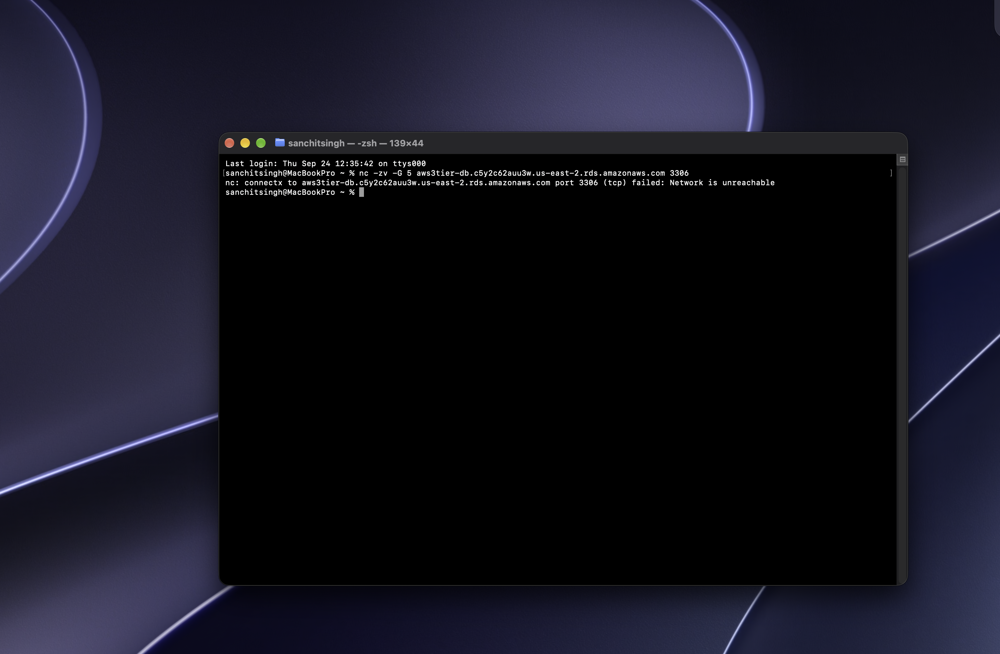
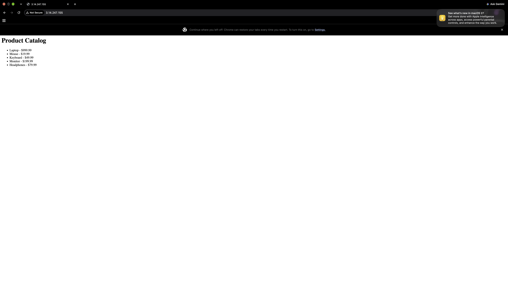
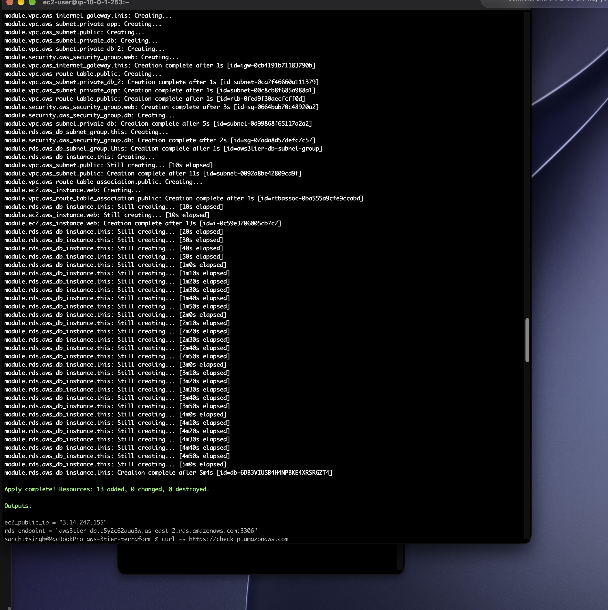

# 3-Tier AWS Architecture — Modular Terraform

A reproducible rebuild of a manually-built 3-tier AWS architecture (originally built by hand through the AWS console), this time defined entirely as reusable, modular Terraform code.

## Architecture

- **VPC** (`10.0.0.0/16`) with **4 subnets** across 3 Availability Zones
- **Public subnet**: 1 EC2 instance running nginx (reverse proxy) + Flask (app layer)
- **Private subnets**: 2 subnets dedicated to RDS (MySQL), with no route to the internet at all — plus 1 reserved for future app-tier separation
- **Security groups**: `web-sg` allows SSH (restricted to my IP) and HTTP (public); `db-sg` allows MySQL **only from `web-sg`**, referenced by security group ID rather than IP range

## Why modular Terraform

The project is split into 4 independent modules — `vpc`, `security`, `ec2`, `rds` — each with its own `main.tf` / `variables.tf` / `outputs.tf`, wired together by a root module. This mirrors how real teams structure infrastructure: modules stay reusable and portable, and one module's outputs feed automatically into another's inputs (e.g. the security module receives the VPC's ID as an input, rather than a hardcoded value).

aws-3tier-terraform/
├── main.tf, variables.tf, outputs.tf, terraform.tfvars (root — ties everything together)
└── modules/
├── vpc/ → VPC, 4 subnets, Internet Gateway, route table
├── security/ → web-sg, db-sg
├── ec2/ → EC2 instance (nginx + Flask)
└── rds/ → DB subnet group + RDS MySQL instance

## Key concepts demonstrated

- **Infrastructure as Code** — the entire environment (10+ resources) is created or destroyed with one command, rather than manual console clicks
- **Network-level isolation, verified by testing** — not just configured and assumed. A port-reachability test from outside the VPC confirms the database is genuinely unreachable (see screenshot below)
- **Secrets kept out of version control** — `terraform.tfvars` and Terraform state files (which can contain the database password) are excluded via `.gitignore`
- **Identity-based security** — the database's security group trusts the web server's security group, not an IP address

## A real bug, and how it was diagnosed

After the first deployment, SSH to the EC2 instance timed out — even though the security group correctly allowed my IP. Diagnosed layer by layer with the AWS CLI: current IP ✓, security group  rule ✓, instance state ✓, instance's public IP ✓, and finally the subnet's route table — which came back **completely empty**. Root cause: the original `vpc` module built the VPC and subnets, but never created an Internet Gateway or a route table. A security group only controls what's *allowed* once traffic arrives; a route table controls whether there's a *path* there at all. Fixed by adding an Internet Gateway, a route table with a route to it, and a route table association for the public subnet.

## Verification

Confirmed RDS is completely unreachable from outside the VPC, using a port-reachability test from my own laptop:

The application, working end-to-end (browser → nginx → Flask → RDS):

The full environment built from code in one command:

## Tech stack

Terraform · AWS (VPC, EC2, RDS, IAM, Security Groups) · Flask · PyMySQL · nginx · MySQL

.
